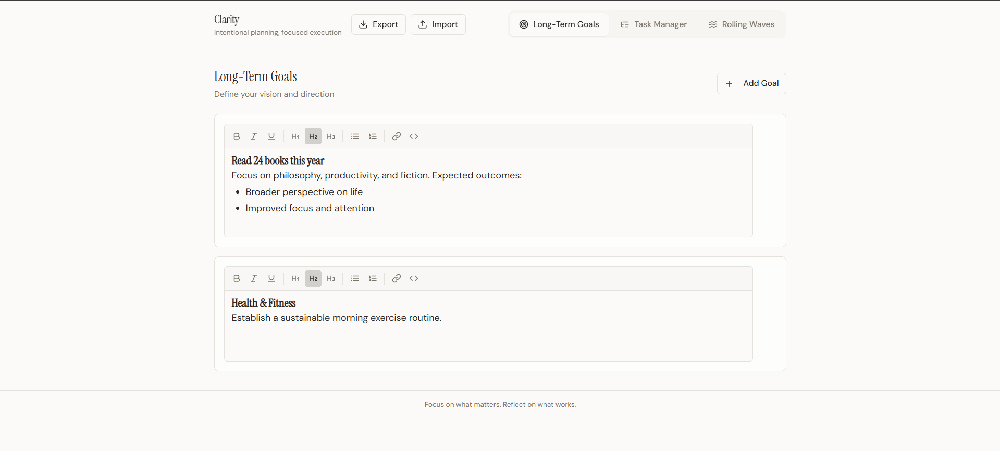
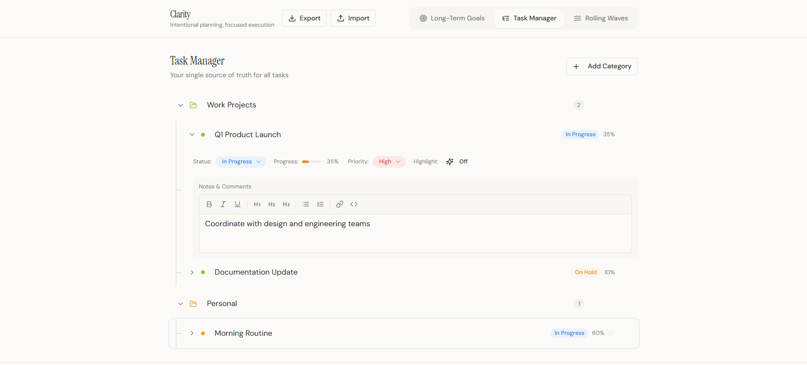
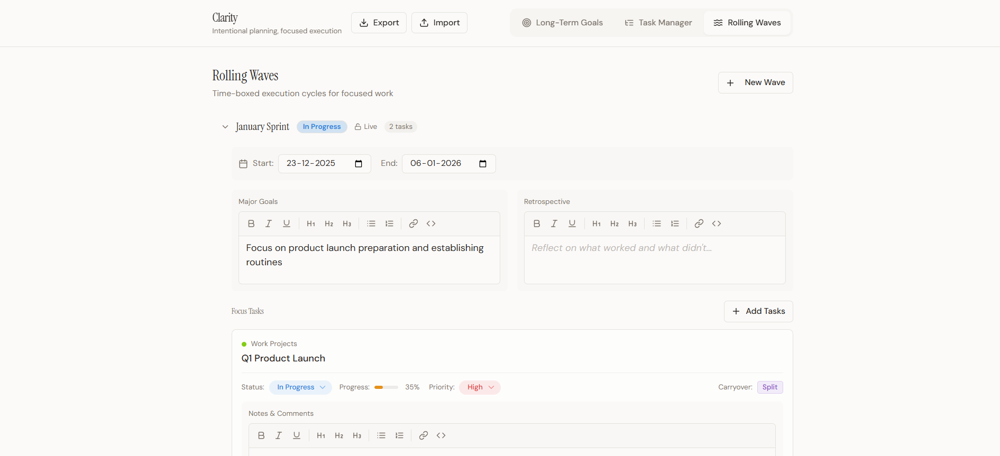
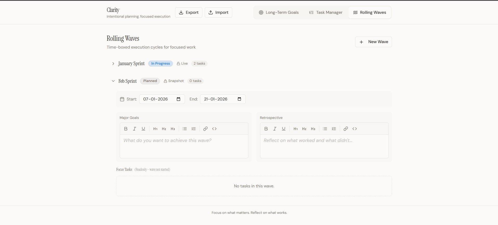

  

  <em>
    Think clearly. Plan deliberately. Execute without mental clutter.
  </em>

  A calm, opinionated system for focused execution — one meaningful phase at a time.

# Clarity

Clarity is a simple but opinionated system to help you **think clearly, plan deliberately, and execute without mental clutter**.

It is not just another task manager.
Clarity is designed to reduce overthinking, prevent parallel confusion, and force focus, one meaningful phase at a time.

---

## Why Clarity Exists

Most productivity tools fail not because they lack features, but because they allow **too much freedom at the wrong time**.

Clarity is built around a few strong ideas:

* You can’t execute everything at once
* Goals need structure, but also flexibility
* Old plans should not interfere with current focus
* Visual clarity matters more than raw metrics

---

## How Clarity Works (User Manual)

### 1. Long-Term Goals

* You can write long-term goals freely using a **WYSIWYG editor**
* No forced categories or rigid formats
* Think of this as your *thinking space*, not a checklist

---

### 2. Task Manager

* Tasks are organized using **categories and sub-categories**
* Both categories and sub-categories support rich text (WYSIWYG)
* Categories are color-coded to help your brain group things visually
* You can highlight important sub-categories if needed

---

### 3. Waves (The Core Concept)

A **Wave** represents a focused phase of execution.

Each wave:

* Has a **start date and end date**
* Represents what you are actively working on
* Can be in one of three states:

  * In Progress
  * Completed
  * Stale (read-only snapshot)

#### Important rules:

* Only **one wave can be active at a time**
* Waves **cannot overlap** in date range
* Tasks can only be linked to the **currently active wave**
* Once a wave’s end date is exceeded, it is automatically marked as *Completed*

---

### 4. Completed Waves = Snapshots

* When a wave is completed, its data becomes a **snapshot**
* Completed waves do NOT stay linked to the live task manager
* This prevents old goals from silently influencing new plans
* If a completed wave’s date is edited or extended, it can move back to *In Progress*

---

### 5. Safety & UX Decisions

* Every delete action asks for confirmation (“Are you sure?”)
* Wave dates are always editable
* Visual clarity is prioritized over dense dashboards

---

### 6. Color Selection

* Categories use a **color palette picker**
* You are not limited to predefined colors
* Any HEX color can be chosen
* Existing colors continue to work without breaking anything

---

### 7. Import & Export

* You can export your data as a backup
* Imported files are normalized automatically
* Older exports remain compatible
* You should never lose data due to format issues

---

## What Clarity Is Not

* Not a Jira / Trello replacement
* Not a time-tracking or micromanagement tool
* Not designed for team management (at least for now)

Clarity is for **individuals who want calm control, not chaos disguised as productivity**.

---

# For Developers & Contributors

Clarity is open to contributors who value **clean logic, predictable behavior, and thoughtful UX**.

---

## Tech Stack

### Frontend

* **React**
* **TypeScript**
* **Modern state management** (predictable & explicit)
* **WYSIWYG editor** for rich text input
* **Color picker library** (HEX-based storage)
* Clean component separation (no monolith UI components)

---

### Styling

* Utility-first CSS approach (e.g. Tailwind or equivalent)
* Emphasis on readability and visual hierarchy
* Color is treated as data, not just decoration

---

### Data Handling

* Strong schema validation during import/export
* Defensive normalization (arrays, defaults, backward compatibility)
* No silent failures
* Exported data must always be re-importable

---

### Architecture Principles

* Single source of truth for wave state
* Explicit lifecycle transitions (In Progress → Completed → Snapshot)
* No overlapping execution windows
* UI reflects business rules, not the other way around

---

## Contribution Guidelines (High Level)

* Respect existing mental models (waves, snapshots, focus)
* Avoid feature creep
* Every new feature should answer:
  **“Does this improve clarity or add noise?”**
* Backward compatibility is mandatory
* UX simplicity > clever abstractions

---

## Vision (Short)

Clarity aims to become a **thinking companion**, not just a productivity app.

Something you trust when your mind feels overloaded.

---

### Ownership & License

**Owner:** Rajkishor Maharana  
© 2025-26 — All rights reserved

