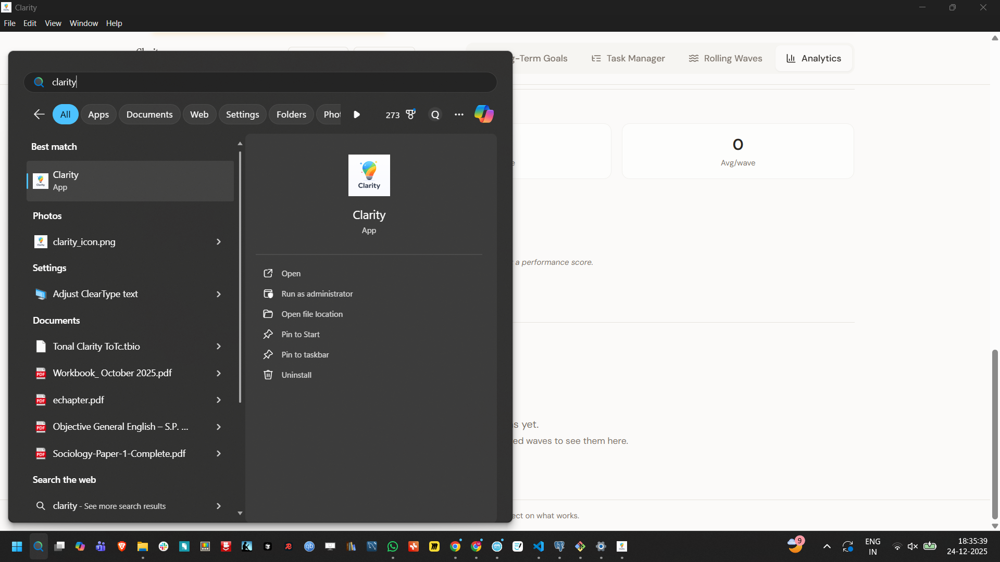
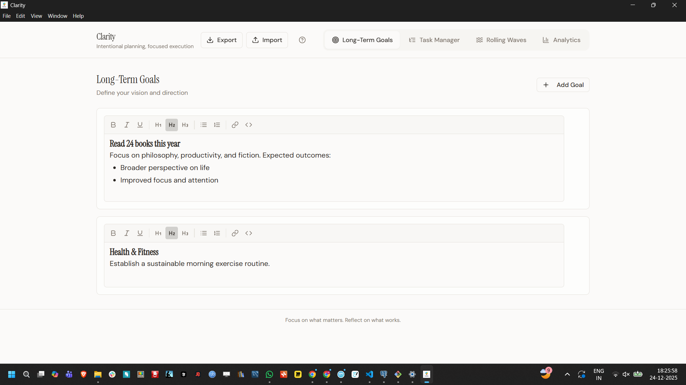
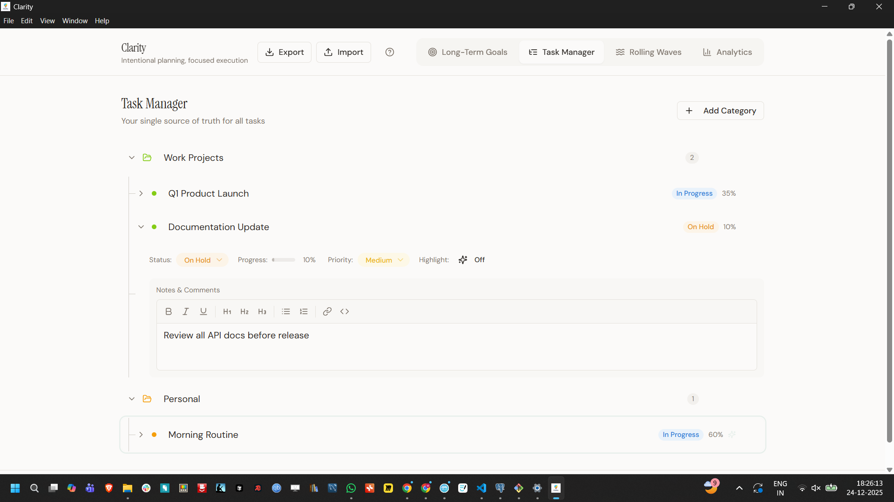
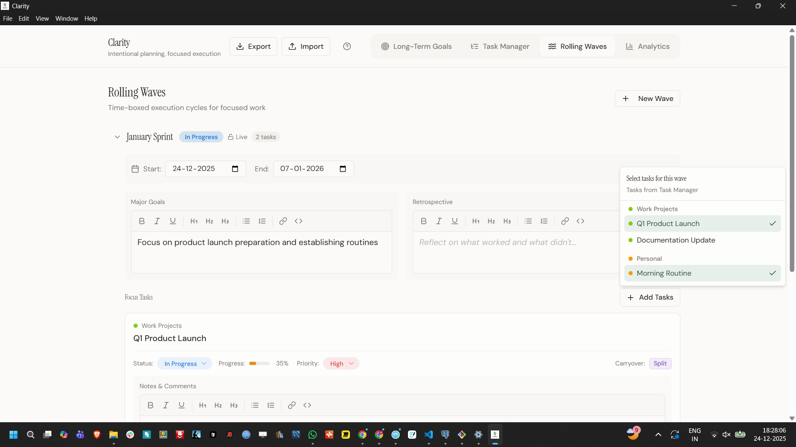
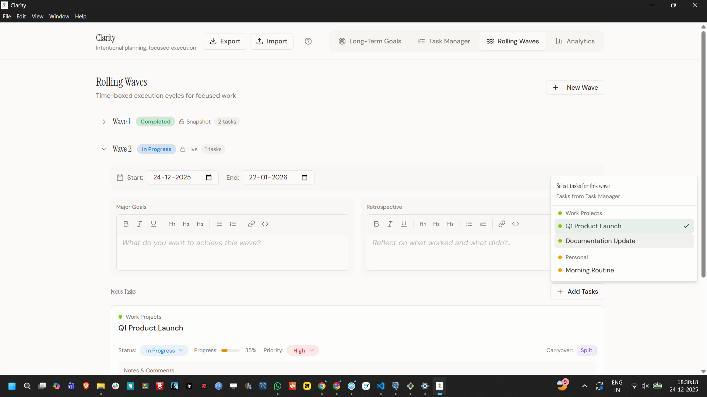
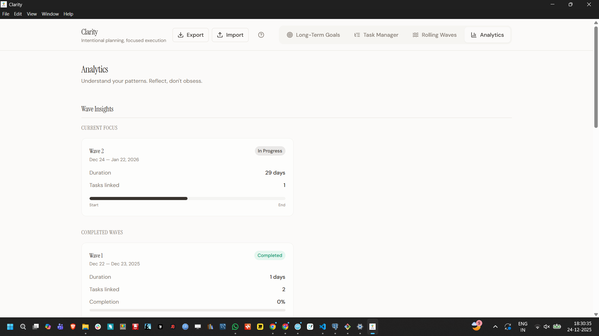
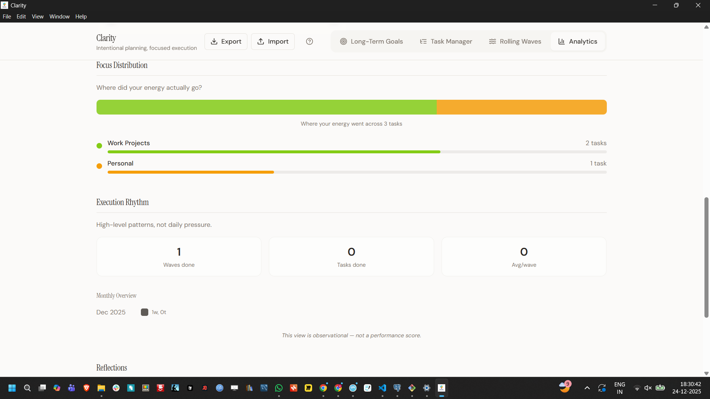

  

  <em>
    Think clearly. Plan deliberately. Execute without mental clutter.
  </em>

 Inspired by (Rolling wave approach to project management)[https://www.pmi.org/learning/library/rolling-wave-approach-project-management-10514]

# Clarity

Clarity is now available as a native **Windows desktop application**.

### Download

- **Version:** 1.2.0  
- **Windows Installer (.exe): Download [here](https://github.com/mrajkishor/Clarity/releases/download/v1.2.0/Clarity.Setup.1.1.0.exe)**  

> Download the installer, run it once, and Clarity will be available from the Start Menu like a regular Windows app.
> 

### Notes

- Windows only
- Works fully offline
- No browser required
- All data remains on your local machine

---

## About this App

Clarity is a simple but opinionated system to help you **think clearly, plan deliberately, and execute without mental clutter**.

It is not just another task manager.
Clarity is designed to reduce overthinking, prevent parallel confusion, and force focus, one meaningful phase at a time.

---

## Why Clarity Exists

Most productivity tools fail not because they lack features, but because they allow **too much freedom at the wrong time**.

Clarity is built around a few strong ideas:

* You can’t execute everything at once
* Goals need structure, but also flexibility
* Old plans should not interfere with current focus
* Visual clarity matters more than raw metrics

---

## How Clarity Works (User Manual)

### 1. Long-Term Goals

* You can write long-term goals freely using a **WYSIWYG editor**
* No forced categories or rigid formats
* Think of this as your *thinking space*, not a checklist

---

### 2. Task Manager

* Tasks are organized using **categories and sub-categories**
* Both categories and sub-categories support rich text (WYSIWYG)
* Categories are color-coded to help your brain group things visually
* You can highlight important sub-categories if needed

---

### 3. Waves (The Core Concept)

A **Wave** represents a focused phase of execution.

Each wave:

* Has a **start date and end date**
* Represents what you are actively working on
* Can be in one of three states:

  * In Progress
  * Completed
  * Stale (read-only snapshot)

#### Important rules:

* Only **one wave can be active at a time**
* Waves **cannot overlap** in date range
* Tasks can only be linked to the **currently active wave**
* Once a wave’s end date is exceeded, it is automatically marked as *Completed*

---

### 4. Completed Waves = Snapshots

* When a wave is completed, its data becomes a **snapshot**
* Completed waves do NOT stay linked to the live task manager
* This prevents old goals from silently influencing new plans
* If a completed wave’s date is edited or extended, it can move back to *In Progress*

---

### 5. Safety & UX Decisions

* Every delete action asks for confirmation (“Are you sure?”)
* Wave dates are always editable
* Visual clarity is prioritized over dense dashboards

---

### 6. Color Selection

* Categories use a **color palette picker**
* You are not limited to predefined colors
* Any HEX color can be chosen
* Existing colors continue to work without breaking anything

---

### 7. Import & Export

* You can export your data as a backup
* Imported files are normalized automatically
* Older exports remain compatible
* You should never lose data due to format issues

---

## What Clarity Is Not

* Not a Jira / Trello replacement
* Not a time-tracking or micromanagement tool
* Not designed for team management (at least for now)

Clarity is for **individuals who want calm control, not chaos disguised as productivity**.

---

# For Developers & Contributors

Clarity is open to contributors who value **clean logic, predictable behavior, and thoughtful UX**.

---

## Tech Stack Overview

Clarity is built as a **modern, front-end focused application** with strong emphasis on predictability, simplicity, and long-term maintainability.

The stack choices favor:

* Explicit state over magic
* Calm UX over flashy abstractions
* Developer clarity over cleverness

---

## Frontend

### React

* Core UI library
* Component-driven architecture
* Clean separation of concerns (layout, features, state)

Used for:

* Rendering all views (Goals, Tasks, Waves, Analytics)
* Declarative UI updates based on state changes

---

### TypeScript

* Used across the entire codebase
* Strong typing for:

  * State models
  * Import / export schemas
  * Component props
* Prevents silent runtime issues, especially during data import/export

---

## State Management

### Custom Store (Zustand-style pattern)

* Centralized productivity state (`useProductivity`)
* Single source of truth for:

  * Active tab
  * Waves
  * Tasks
  * Goals
  * Analytics data

Why this approach:

* Lightweight
* No boilerplate explosion
* Easy to reason about state transitions
* Ideal for an opinionated app like Clarity

---

## UI & Layout

### Tailwind CSS

* Utility-first styling approach
* Consistent spacing, typography, and color usage
* Easy theme adjustments (light/dark, muted tones)

Used for:

* Layout width control (`max-w-*`)
* Typography hierarchy
* Color application for categories and waves
* Responsive design

---

### Component Architecture

Reusable, well-scoped components such as:

* `TabNavigation`
* `LongTermGoals`
* `TaskManager`
* `RollingWaves`
* `Analytics`
* `BackupControls`

Each component:

* Owns its UI logic
* Reads from state, does not mutate blindly
* Reflects business rules visually

---

## Rich Text Editing

### WYSIWYG Editor

* Used for:

  * Long-term goals
  * Categories and sub-categories
* Allows free-form thinking without rigid structures

Design choice:

* Writing should feel natural
* Goals are thoughts, not database rows

---

## Color System

### Color Picker (HEX-based)

* Full color palette instead of fixed presets
* Stores colors as HEX values
* Backward compatible with older saved colors

Used for:

* Category visualization
* Cognitive grouping
* Visual clarity, not decoration

---

## Analytics (Read-Only Layer)

### Derived State

* Analytics data is **derived**, not stored separately
* Calculated from:

  * Waves
  * Tasks
  * Categories

Key rule:

* Analytics never mutate core data
* Purely reflective, not operational

---

## Import / Export System

### JSON-based Backup

* Full application state export
* Strong schema normalization during import
* Defensive parsing:

  * Arrays enforced
  * Defaults applied
  * Backward compatibility preserved

Goal:

* Any exported file should always be importable
* No data loss due to version changes

---

## Architecture Principles

* Single active wave at a time
* Immutable completed waves (snapshots)
* No overlapping execution windows
* UI mirrors business logic, not vice-versa
* Predictability > flexibility

---

## What’s Intentionally Not Used

* No heavy UI frameworks
* No Redux boilerplate
* No server-side dependency (yet)
* No analytics trackers or telemetry
* No gamification libraries

Clarity is intentionally **quiet by design**.

> **Clarity is built with React + TypeScript + Tailwind, powered by a lightweight state store, designed around intentional constraints rather than feature overload.**

### Ownership & License

**Owner:** Rajkishor Maharana  
© 2025-26 — All rights reserved

